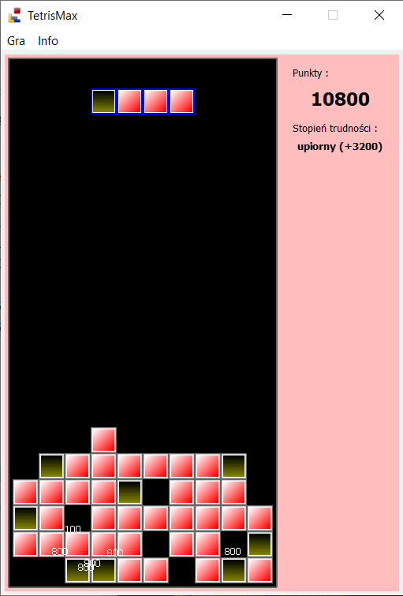
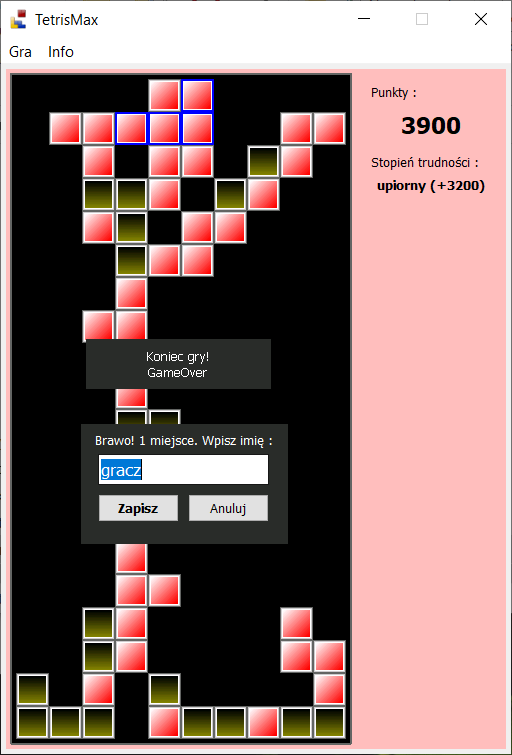

# TetrisMax
Gra Tetris - układanie bloków
* bloki składają się z piasku i kamieni
* piaskowe bloki nie zatrzymują się po uderzeniu bloku tylko spadają niżej jeśli to możliwe
* dodatkowe pkt na spadnięty blok piasku
* punkty za zapełnienie całej poziomej linii (jak w zwykłym tetrisie)
* 3 tryby trudności różnie punktowane
* Możliwość zmiany trybu trudności w czasie gry
* najlepsze wyniki zapisywane się w systemowym rejestrze

## screen1 :

## screen2 :
